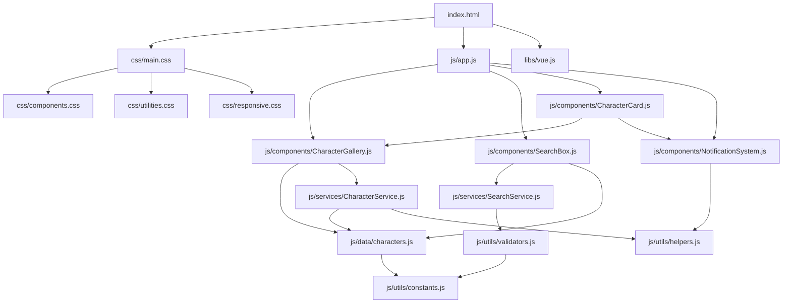
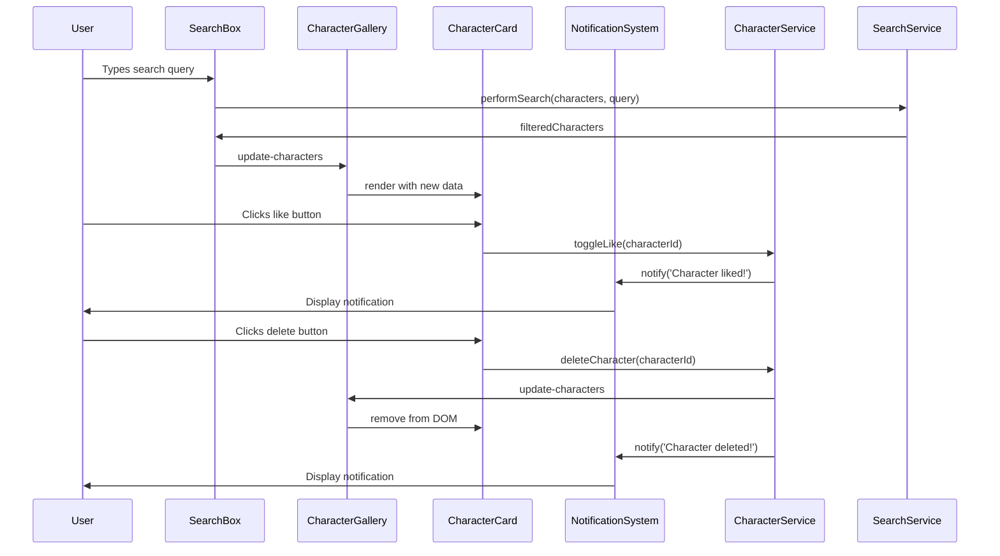

# Codebase Map
# Star Wars Lego — Greenfield

**Document Version:** 1.0

## 1. Project Structure Overview

### 1.1 Directory Architecture
```
star-wars-lego/                          # Project root
├── index.html                          # Main application entry point
├── css/                                # Stylesheets directory
│   ├── main.css                        # Main application styles
│   ├── components.css                  # Component-specific styles
│   ├── utilities.css                   # Utility classes and variables
│   └── responsive.css                  # Media queries and responsive rules
├── js/                                 # JavaScript application code
│   ├── app.js                          # Main Vue.js application instance
│   ├── components/                     # Vue.js components
│   │   ├── CharacterGallery.js         # Gallery display component
│   │   ├── SearchBox.js                # Search functionality component
│   │   ├── CharacterCard.js            # Individual character display component
│   │   └── NotificationSystem.js      # Alert/notification management
│   ├── data/                           # Data management
│   │   ├── characters.js               # Character data definitions
│   │   └── config.js                   # Application configuration
│   ├── utils/                          # Utility functions
│   │   ├── helpers.js                  # General helper functions
│   │   ├── validators.js               # Input validation utilities
│   │   └── constants.js                # Application constants
│   └── services/                       # Business logic services
│       ├── CharacterService.js         # Character business logic
│       ├── SearchService.js            # Search functionality logic
│       └── StorageService.js           # Data persistence logic
├── assets/                             # Static assets
│   ├── images/                         # Image resources
│   │   ├── characters/                 # Character images (8 files)
│   │   │   ├── luke-skywalker.jpg      # Luke Skywalker
│   │   │   ├── darth-vader.jpg         # Darth Vader
│   │   │   ├── princess-leia.jpg       # Princess Leia
│   │   │   ├── han-solo.jpg            # Han Solo
│   │   │   ├── c3po.jpg                # C-3PO
│   │   │   ├── r2d2.jpg                # R2-D2
│   │   │   ├── chewbacca.jpg           # Chewbacca
│   │   │   └── boba-fett.jpg            # Boba Fett
│   │   └── ui/                         # User interface images
│   │       ├── logo.svg                # Application logo
│   │       └── favicon.ico              # Browser icon
│   └── icons/                          # Icon resources (if using Material Symbols)
├── libs/                               # External libraries
│   ├── vue.js                          # Vue.js 2.x framework
│   └── (optional other libraries)
├── docs/                               # Documentation
│   ├── README.md                       # Project documentation
│   └── LEARNING.md                     # Educational guide
└── tests/                              # Test files (future enhancement)
    ├── manual-tests/                   # Manual testing procedures
    └── examples/                       # Code examples for education
```

### 1.2 File Dependencies Map



## 2. Component Architecture Map

### 2.1 Vue.js Component Hierarchy
```javascript
// Component dependency structure
const COMPONENT_HIERARCHY = {
  'StarWarsLegoApp': {           // Root application
    children: [
      'AppHeader',
      'AppMain',
      'AppFooter'
    ]
  },
  
  'AppMain': {
    children: [
      'SearchBox',
      'CharacterGallery',
      'NotificationSystem'
    ]
  },
  
  'CharacterGallery': {
    children: [
      'CharacterCard',          // Repeated for each character
      'GalleryStats'            // Character statistics
    ]
  },
  
  'CharacterCard': {
    children: [
      'CharacterImage',
      'CharacterInfo',
      'CharacterActions'
    ]
  },
  
  'NotificationSystem': {
    children: [
      'Notification'             // Repeated for each notification
    ]
  }
};
```

### 2.2 Data Flow Architecture


## 3. Infrastructure Code Map

### 3.1 Entry Point - index.html Structure
```html
<!-- index.html = Application shell -->
<!DOCTYPE html>
<html lang="pt-BR">
<head>
  <!-- Critical resources -->
  <meta charset="UTF-8">
  <title>Star Wars Lego - Interactive Learning</title>
  
  <!-- Font preloading for performance -->
  <link rel="preconnect" href="https://fonts.googleapis.com">
  <link rel="stylesheet" href="https://fonts.googleapis.com/css2?family=Acme&family=Handlee&display=swap">
  
  <!-- Application styles -->
  <link rel="stylesheet" href="css/main.css">
</head>
<body>
  <!-- Vue.js application mount point -->
  <div id="app">
    <!-- Content managed by Vue.js -->
  </div>
  
  <!-- External libraries -->
  <script src="libs/vue.js"></script>
  
  <!-- Application bootstrap -->
  <script src="js/app.js"></script>
</body>
</html>
```

### 3.2 Application Bootstrap - js/app.js
```javascript
// js/app.js = Application entry point and configuration
document.addEventListener('DOMContentLoaded', () => {
  // Import services and data
  const CharacterService = require('./services/CharacterService.js');
  const SearchService = require('./services/SearchService.js');
  const StorageService = require('./services/StorageService.js');
  
  // Import components
  require('./components/CharacterGallery.js');
  require('./components/SearchBox.js');
  require('./components/CharacterCard.js');
  require('./components/NotificationSystem.js');
  
  // Initialize Vue.js application
  new Vue({
    el: '#app',
    
    // Global application state
    data: {
      characters: [],              // Character collection
      searchQuery: '',             // Current search input
      notifications: [],           // Active notifications
      isLoading: false,            // Loading state
      userGreeting: 'Welcome!'     // Personalized greeting
    },
    
    // Application lifecycle
    created() {
      this.initializeApplication();
    },
    
    // Core application methods
    methods: {
      async initializeApplication() {
        this.isLoading = true;
        await this.loadCharacters();
        this.setupEventListeners();
        this.isLoading = false;
      },
      
      loadCharacters() {
        this.characters = CharacterService.loadAllCharacters();
      },
      
      setupEventListeners() {
        // Global error handling
        window.addEventListener('error', this.handleGlobalError);
      },
      
      handleGlobalError(event) {
        console.error('Application error:', event.error);
        this.showNotification('An error occurred. Please refresh the page.');
      },
      
      showNotification(message, type = 'info') {
        const notification = {
          id: Date.now(),
          message,
          type,
          timestamp: new Date()
        };
        this.notifications.push(notification);
        
        // Auto-remove notification after 3 seconds
        setTimeout(() => {
          this.removeNotification(notification.id);
        }, 3000);
      },
      
      removeNotification(id) {
        const index = this.notifications.findIndex(n => n.id === id);
        if (index > -1) {
          this.notifications.splice(index, 1);
        }
      }
    },
    
    // Computed properties
    computed: {
      filteredCharacters() {
        if (!this.searchQuery.trim()) {
          return this.characters;
        }
        return SearchService.searchCharacters(this.characters, this.searchQuery);
      },
      
      activeCharactersCount() {
        return this.filteredCharacters.filter(c => !c.deleted).length;
      }
    }
  });
});
```

## 4. Component-Level Code Maps

### 4.1 Character Gallery Component
```javascript
// js/components/CharacterGallery.js
/**
 * Character Gallery Component
 * Responsible for displaying the grid of character cards
 */
Vue.component('character-gallery', {
  // Component API
  props: {
    characters: {
      type: Array,
      required: true,
      validator: value => value.every(char => char.id && char.name)
    }
  },
  
  // Component state
  data() {
    return {
      selectedCharacter: null,
      isAnimating: false
    };
  },
  
  // Computed properties
  computed: {
    visibleCharacters() {
      return this.characters.filter(character => !character.deleted);
    },
    
    likedCharactersCount() {
      return this.characters.filter(character => character.liked).length;
    }
  },
  
  // Event handlers
  methods: {
    selectCharacter(character) {
      this.selectedCharacter = character;
      this.$emit('character-selected', character);
    },
    
    onCharacterLiked(characterId) {
      this.$emit('character-liked', characterId);
    },
    
    onCharacterDeleted(characterId) {
      if (confirm('Are you sure you want to delete this character?')) {
        this.$emit('character-deleted', characterId);
      }
    }
  },
  
  // Component template
  template: `
    <section class="character-gallery">
      <header class="gallery-header">
        <h2>Character Gallery</h2>
        <div class="gallery-stats">
          <span>{{ visibleCharacters.length }} characters displayed</span>
          <span>{{ likedCharactersCount }} liked</span>
        </div>
      </header>
      
      <div class="gallery-grid">
        <character-card
          v-for="character in visibleCharacters"
          :key="character.id"
          :character="character"
          @click="selectCharacter(character)"
          @liked="onCharacterLiked"
          @deleted="onCharacterDeleted"
        />
      </div>
    </section>
  `
});
```

### 4.2 Character Card Component
```javascript
// js/components/CharacterCard.js
/**
 * Individual Character Card Component
 * Displays single character with interaction buttons
 */
Vue.component('character-card', {
  props: {
    character: {
      type: Object,
      required: true,
      validator: value => {
        const requiredFields = ['id', 'name', 'image'];
        return requiredFields.every(field => value[field]);
      }
    }
  },
  
  data() {
    return {
      isHovered: false,
      isAnimating: false
    };
  },
  
  computed: {
    likeButtonLabel() {
      return this.character.liked ? 'Remove from favorites' : 'Add to favorites';
    },
    
    deleteButtonLabel() {
      return `Delete ${this.character.name}`;
    },
    
    accessibilityLabel() {
      return `${this.character.name} character card${this.character.liked ? ', liked' : ''}`;
    }
  },
  
  methods: {
    handleCardClick() {
      if (!this.isAnimating) {
        this.triggerAnimation();
        this.$emit('click', this.character);
      }
    },
    
    handleLikeClick(event) {
      event.stopPropagation(); // Prevent card click
      this.triggerAnimation();
      this.$emit('liked', this.character.id);
    },
    
    handleDeleteClick(event) {
      event.stopPropagation(); // Prevent card click
      this.triggerAnimation();
      this.$emit('deleted', this.character.id);
    },
    
    triggerAnimation() {
      this.isAnimating = true;
      setTimeout(() => {
        this.isAnimating = false;
      }, 300);
    },
    
    onMouseEnter() {
      this.isHovered = true;
    },
    
    onMouseLeave() {
      this.isHovered = false;
    }
  },
  
  template: `
    <article 
      class="character-card"
      :class="{
        'character-card--liked': character.liked,
        'character-card--hovered': isHovered,
        'character-card--animating': isAnimating
      }"
      :aria-label="accessibilityLabel"
      role="article"
      tabindex="0"
      @click="handleCardClick"
      @mouseenter="onMouseEnter"
      @mouseleave="onMouseLeave"
      @keydown.enter="handleCardClick"
      @keydown.space="handleCardClick"
    >
      <div class="character-image-container">
        
      </div>
      
      <div class="character-info">
        <h3 class="character-name">{{ character.name }}</h3>
        
        <div class="character-actions">
          <button
            class="action-button action-button--like"
            :aria-pressed="character.liked"
            :aria-label="likeButtonLabel"
            @click="handleLikeClick"
            type="button"
          >
            <span class="sr-only">{{ likeButtonLabel }}</span>
            <span aria-hidden="true">{{ character.liked ? '♥' : '♡' }}</span>
          </button>
          
          <button
            class="action-button action-button--delete"
            :aria-label="deleteButtonLabel"
            @click="handleDeleteClick"
            type="button"
          >
            <span class="sr-only">{{ deleteButtonLabel }}</span>
            <span aria-hidden="true">×</span>
          </button>
        </div>
      </div>
    </article>
  `
});
```

## 5. Service Layer Code Map

### 5.1 Character Service Layer
```javascript
// js/services/CharacterService.js
/**
 * Character Business Logic Service
 * Handles all character-related business operations
 */
class CharacterService {
  constructor(storageService) {
    this.storage = storageService;
    this.characters = this.loadCharacters();
  }
  
  // Load character data from storage
  loadCharacters() {
    const savedCharacters = this.storage.loadUserInteractions();
    
    // Base character data (from data/characters.js)
    const baseCharacters = [
      { id: 1, name: 'Luke Skywalker', image: 'assets/images/characters/luke-skywalker.jpg', liked: false, deleted: false },
      { id: 2, name: 'Darth Vader', image: 'assets/images/characters/darth-vader.jpg', liked: false, deleted: false },
      { id: 3, name: 'Princess Leia', image: 'assets/images/characters/princess-leia.jpg', liked: false, deleted: false },
      { id: 4, name: 'Han Solo', image: 'assets/images/characters/han-solo.jpg', liked: false, deleted: false },
      { id: 5, name: 'C-3PO', image: 'assets/images/characters/c3po.jpg', liked: false, deleted: false },
      { id: 6, name: 'R2-D2', image: 'assets/images/characters/r2d2.jpg', liked: false, deleted: false },
      { id: 7, name: 'Chewbacca', image: 'assets/images/characters/chewbacca.jpg', liked: false, deleted: false },
      { id: 8, name: 'Boba Fett', image: 'assets/images/characters/boba-fett.jpg', liked: false, deleted: false }
    ];
    
    // Merge base data with user interactions
    return baseCharacters.map(character => {
      const userInteraction = savedCharacters.find(s => s.id === character.id);
      if (userInteraction) {
        return { ...character, ...userInteraction };
      }
      return character;
    });
  }
  
  // Toggle character like status
  toggleLike(characterId) {
    const character = this.characters.find(c => c.id === characterId);
    if (character) {
      character.liked = !character.liked;
      this.saveCharacterState(character);
      return character;
    }
    throw new Error(`Character with ID ${characterId} not found`);
  }
  
  // Delete character (soft delete)
  deleteCharacter(characterId) {
    const character = this.characters.find(c => c.id === characterId);
    if (character) {
      character.deleted = true;
      this.saveCharacterState(character);
      return character;
    }
    throw new Error(`Character with ID ${characterId} not found`);
  }
  
  // Save individual character state
  saveCharacterState(character) {
    const userInteraction = {
      id: character.id,
      liked: character.liked,
      deleted: character.deleted,
      lastModified: new Date().toISOString()
    };
    this.storage.saveUserInteraction(userInteraction);
  }
  
  // Get character statistics
  getStatistics() {
    const total = this.characters.length;
    const active = this.characters.filter(c => !c.deleted).length;
    const liked = this.characters.filter(c => c.liked).length;
    
    return { total, active, liked, deleted: total - active };
  }
  
  // Restore deleted character
  restoreCharacter(characterId) {
    const character = this.characters.find(c => c.id === characterId);
    if (character) {
      character.deleted = false;
      this.saveCharacterState(character);
      return character;
    }
    throw new Error(`Character with ID ${characterId} not found`);
  }
}

// Export for use in Vue.js components
if (typeof module !== 'undefined' && module.exports) {
  module.exports = CharacterService;
} else {
  window.CharacterService = CharacterService;
}
```

## 6. CSS Architecture Map

### 6.1 Stylesheet Organization
```css
/* css/main.css - Main entry point */
@import url('./utilities.css');
@import url('./components.css');
@import url('./responsive.css');

/* Main application container */
.app-container {
  max-width: 1200px;
  margin: 0 auto;
  padding: 2rem;
  min-width: 820px;
}

/* Base application styles */
body {
  font-family: var(--font-primary);
  background: var(--color-bg-primary);
  color: var(--color-text-primary);
  line-height: 1.6;
}

.app-header {
  text-align: center;
  margin-bottom: 3rem;
}

.app-main {
  display: grid;
  gap: 2rem;
}

.app-footer {
  text-align: center;
  margin-top: 3rem;
  padding-top: 2rem;
  border-top: 1px solid var(--color-border);
}
```

```css
/* css/utilities.css - CSS custom properties and utilities */
:root {
  /* Color palette */
  --color-bg-primary: #111;
  --color-bg-secondary: #222;
  --color-text-primary: #CCC;
  --color-text-secondary: #999;
  --color-accent-primary: #FD4;
  --color-accent-secondary: #FFD700;
  --color-danger: #FF4444;
  --color-border: #444;
  
  /* Typography */
  --font-primary: 'Acme', sans-serif;
  --font-secondary: 'Handlee', cursive;
  --font-size-base: 1rem;
  --font-size-large: 1.25rem;
  --font-size-small: 0.875rem;
  
  /* Spacing */
  --spacing-xs: 0.25rem;
  --spacing-sm: 0.5rem;
  --spacing-md: 1rem;
  --spacing-lg: 1.5rem;
  --spacing-xl: 2rem;
  
  /* Layout */
  --container-min-width: 820px;
  --border-radius: 0.5rem;
  --transition-fast: 200ms;
  --transition-medium: 300ms;
}

/* Utility classes */
.text-center { text-align: center; }
.text-left { text-align: left; }
.text-right { text-align: right; }

.font-primary { font-family: var(--font-primary); }
.font-secondary { font-family: var(--font-secondary); }

.bg-primary { background: var(--color-bg-primary); }
.bg-secondary { background: var(--color-bg-secondary); }
.text-accent { color: var(--color-accent-primary); }

.sr-only {
  position: absolute;
  width: 1px;
  height: 1px;
  padding: 0;
  margin: -1px;
  overflow: hidden;
  clip: rect(0, 0, 0, 0);
  white-space: nowrap;
  border: 0;
}
```

## 7. Data Layer Code Map

### 7.1 Character Data Structure
```javascript
// js/data/characters.js - Base character data
const CHARACTER_DATA = [
  {
    id: 1,
    name: 'Luke Skywalker',
    image: 'assets/images/characters/luke-skywalker.jpg',
    description: 'Hero of the Rebel Alliance and Jedi Knight',
    category: 'hero',
    affiliation: 'Rebel Alliance',
    liked: false,
    deleted: false
  },
  {
    id: 2,
    name: 'Darth Vader',
    image: 'assets/images/characters/darth-vader.jpg',
    description: 'Dark Lord of the Sith and enforcer of the Empire',
    category: 'villain',
    affiliation: 'Galactic Empire',
    liked: false,
    deleted: false
  },
  // ... more character data
];

// Data validation schema
const CHARACTER_SCHEMA = {
  id: {
    type: 'number',
    required: true,
    min: 1,
    max: 8
  },
  name: {
    type: 'string',
    required: true,
    minLength: 1,
    maxLength: 50
  },
  image: {
    type: 'string',
    required: true,
    pattern: '^assets/images/characters/.+\\.(jpg|png|webp)$'
  },
  description: {
    type: 'string',
    required: false,
    maxLength: 200
  },
  category: {
    type: 'string',
    required: true,
    enum: ['hero', 'villain', 'support']
  },
  liked: {
    type: 'boolean',
    required: false,
    default: false
  },
  deleted: {
    type: 'boolean',
    required: false,
    default: false
  }
};
```

---

*Star Wars Lego Codebase Map — Globant Delivery Team*